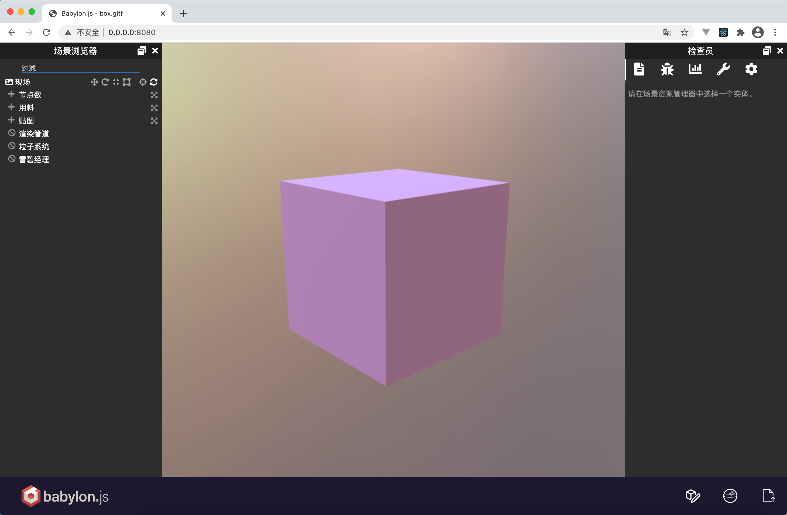
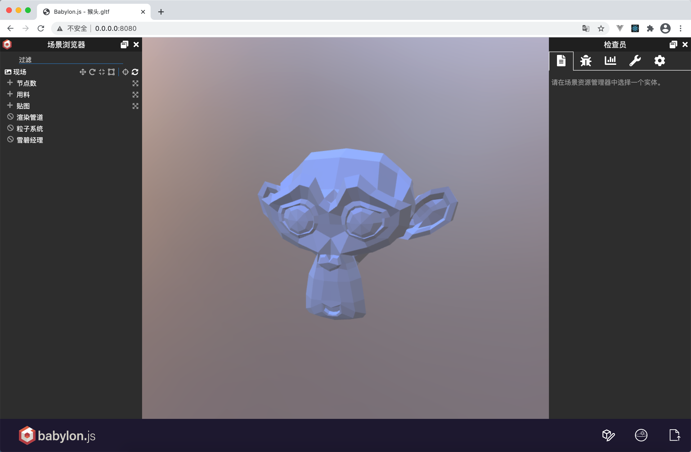

# babylon-sandbox-only
babylonjs 独立沙盒运行
- 安装依赖
```
npm install
//或
yarn
```
- 启动（一定要sudo启动，否则加载模型会提示404）
```
sudo npm run start
```
- 打包
```
sudo npm run build
```
测试模型在`./model`文件夹中，包括blend源文件，即blender默认立方体和猴头模型，添加纯色材质

